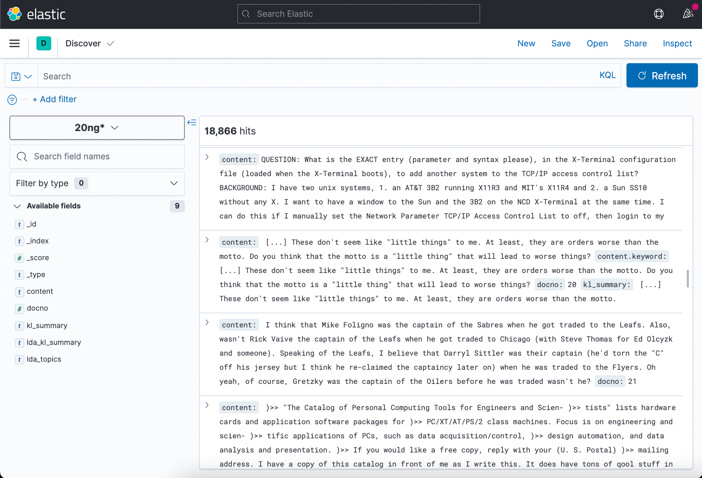
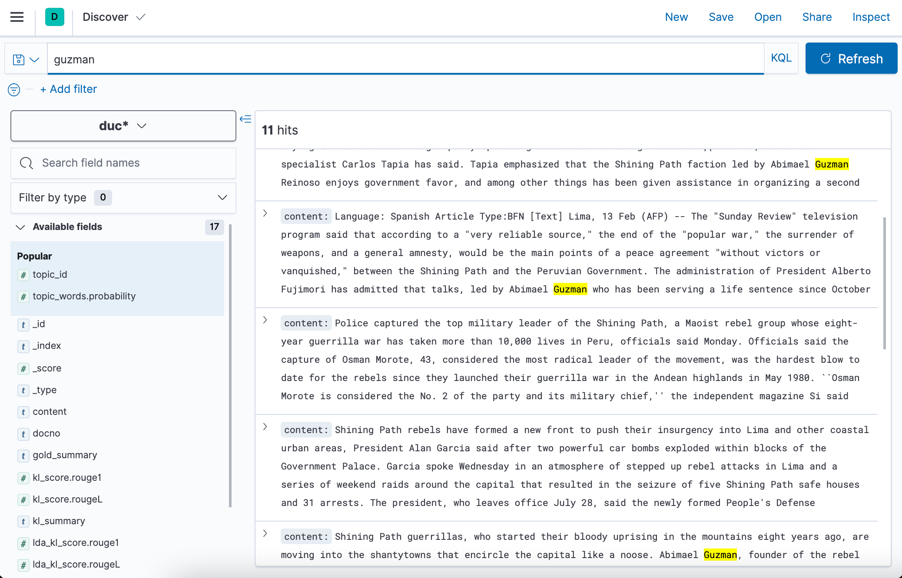
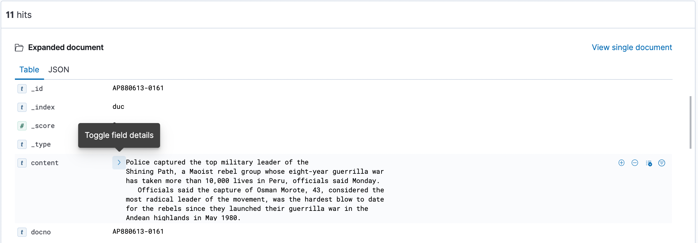
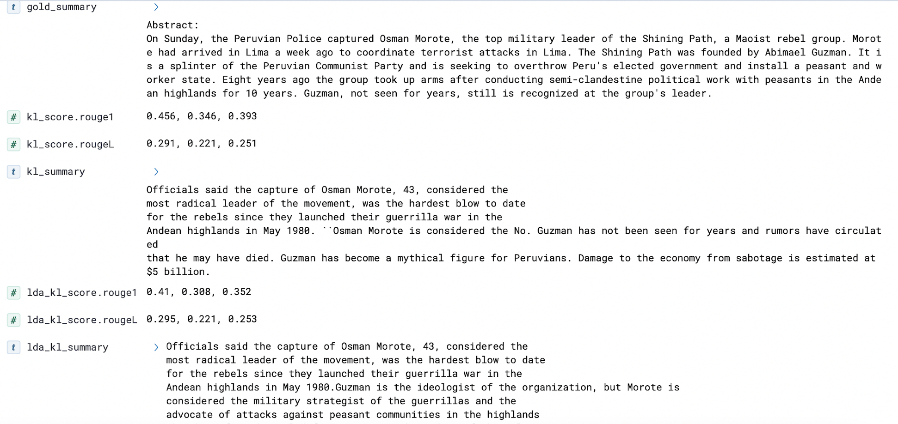

# LDA and KL Summaries Indexed with Elastic Search 

A Python library that creates extractive summaries using Latent Dirichlet Allocation (LDA) topic modeling and Kullback-Lieber (KL) Sum for large document-based datasets


## Installation

Navigate to  [Elastic Search Download Site](https://www.elastic.co/) to install Elastic Search and Kibana

After installation, run Elastic on port localhost:9200 and run Kibana on port localhost:5601 

```bash
cd elasticsearch-7.12.0/bin/
./elasticsearch

cd kibana-7.12.0-darwin-x86/bin/
./kibana
```


## Index

Once Kibana and Elastic Search are running on their respective ports, the next step is to run the LDA topic modeling algorithm and KL-Sum algorithm on the datasets. The python code uses two datasets to produce entries of summaries : DUC (320 documents) and 20 News Group (18000 documents) 

To produce entries summaries for each document in elastic search, run the following python script.


```
cd elastic-search-indexing-script/

python index_client.py
```
Once the document summaries are uploaded to kibana, the next step is to produce index patterns.
This is a fairly straightforward task. Please refer to instructions provided by the [Kibana Guide](https://www.elastic.co/guide/en/kibana/current/index-patterns.html).

## Usage and Results

**Search Document By Keyword**



**View Original Document Content**

Once an doucment entry is in focus, use the triangle icon to expand its original content


Here is an example of the original content of a document entry
```

Police captured the top military leader of the
Shining Path, a Maoist rebel group whose eight-year guerrilla war
has taken more than 10,000 lives in Peru, officials said Monday.
   Officials said the capture of Osman Morote, 43, considered the
most radical leader of the movement, was the hardest blow to date
for the rebels since they launched their guerrilla war in the
Andean highlands in May 1980.
   ``Osman Morote is considered the No. 2 of the party and its
military chief,'' the independent magazine Si said recently. ``For
some Shining Path experts, Morote might even be, in practice, the
true leader of the organization.''
   Abimael Guzman, a former professor of philosophy, founded the
Shining Path movement and is generally recognized as its leader.
   The Shining Path is seeking to overthrow Peru's elected
government and install a peasant and worker state patterned after
the ideas of Mao Tse-tung.
   Deputy Interior Minister Agustin Mantilla said Morote was
arrested before dawn Sunday at a house in downtown Lima along with
two women. Police sources said two other men also were arrested.
   Mantilla said Morote had fake identification papers but was
identified by his fingerprints.
   Counterinsurgency sources said police raided the house after
neighbors told them of suspicious behavior by the people living
there. The sources said police discovered revolutionary propaganda,
dynamite and a revolver.
   Col. Javier Palacios, a top official in the counterinsurgency
police, presented Morote to the press Monday but did let him speak.
   Palacios said police had suspected Morote was in the house. He
said Morote put up no resistance.
   The colonel said Morote arrived in Lima a week ago from the
northern highlands to coordinate terrorists attacks in the capital.
Palacios said the attacks were planned this week to mark the second
anniversary of prison riots in which security forces killed more
than 250 rebel inmates.
   There have been reports in recent months of a growing rivalry
between Morote and Guzman, and Mantilla said he did not discount
the possibility that Guzman betrayed Morote to get him out of the
way.
   Morote, known within the rebel band as ``Comrade Remigio,'' is
second in importance only to Guzman, who founded the Shining Path
as a splinter group of the Peruvian Communist Party.
   The Shining Path devoted itself to 10 years of semi-clandestine
political work with peasants in the impoverished Andean highlands
before taking up arms.
   Guzman is the ideologist of the organization, but Morote is
considered the military strategist of the guerrillas and the
advocate of attacks against peasant communities in the highlands
that have formed civil defense units on the orders of the military.
   Counterinsurgency sources said Morote's capture will create a
power vacuum within the central committee of the Shining Path and
spark tension until a replacement is found.
   Guzman, Morote and other Shining Path leaders went underground
in the late 1970s before launching their guerrilla war, which has
claimed more than 10,000 lives.
   Guzman has not been seen for years and rumors have circulated
that he may have died. But most counterinsurgency experts believe
that Guzman, described as brilliant by his former professors, is
still alive.
   Guzman has become a mythical figure for Peruvians. Various
rumors say that he is living abroad, that he moves about Peru
disguised as a priest, that he works as a day laborer in Lima's
crowded street markets.
   Since 1980, the movement has expanded from its base in the
highland state of Ayacucho and now launches attacks throughout much
of this impoverished nation.
   Damage to the economy from sabotage is estimated at $5 billion.
```

View Extractive Summary Fields 
1. Gold Summary - Written by a person. Used to measure how well algorithms performed on summary tasks
2. KL Summary - Created by algorithm. Based on words probability distribution (PD). PD is a distribution proportional to counts of words in document
3. LDA KL Summary - Created by algorithm. While still a distribution over words, is computed using Latent Dirichlet Allocation (LDA) topic modeling
4. Rogue Score - Measures the number of matching 'n-grams' between text generated by algorithm and a the 'Gold Summary' written by a person
5. Topics - (LDA generated) - Most relevant topics that pertains to the current document entry




## License

[MIT](https://choosealicense.com/licenses/mit/) License
